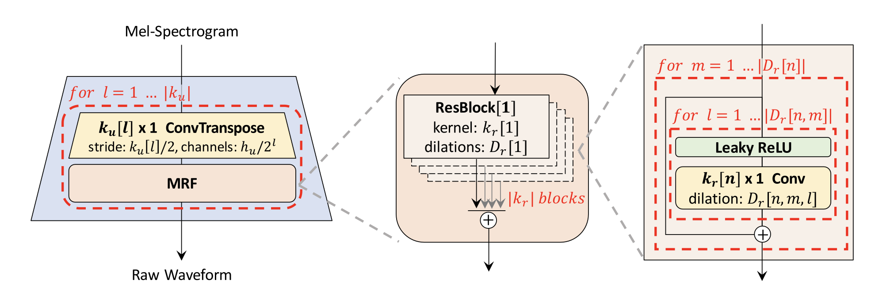

# Hi-Fi GAN Re-implementation

This repo contains a reimplementation of neural vocoder from [Hi-Fi GAN paper](https://arxiv.org/abs/2010.05646). The moodel has few slight differences from original one. First, we use much larger multi-period discriminator with additional sub-final layer. Second, we average residual blocks' outputs in generator instead of adding, which lead to better stability during training. 

Preprocessing steps heavily rely on [official implentation](https://github.com/jik876/hifi-gan) and [Mel-GAN](https://github.com/descriptinc/melgan-neurips).




## Setup

First, clone the repo 
```bash
git clone https://github.com/Mikezz1/hifi-gan
pip3 install -r requirements
```

Then install all dependencies

```bash
cd hifi_gan

pip3 install -r requirements
```

And download model checkpoint (if file is unavailable use [gdrive link](https://drive.google.com/file/d/1PMwOgNYpugb6JPWBsOc2FCcvAVD8qrvH/view?usp=sharing))
```bash
sh load_checkpoint.sh
```


## Training

To start training, run the following script. It takes one epoch to achieve distinguishable words, 4-5 epochs to get rid of robtic voice and at least 20 epochs to achive mostly clean sound.

```bash
python3 train.py --config="configs/base_config.yaml"
```


## Inference

To run model on test samples, you need to calculate melspecs for reference audios first:
```bash 
python3 prepare_test.py
```
Make sure that you have reference audios `audio_1.wav`, `audio_2.wav` and `audio_3.wav` in `data` folder (or specify other path / filenames inside the script). Then, run the inference script:

```bash
python3 inference.py --config='path/to/config' --mel_filenames='test_spec'
```


`test_spec` option specifies filename pattern of source melspecs


`config` option is a path to config. Make sure that you specified path to checkpoint in the config.
